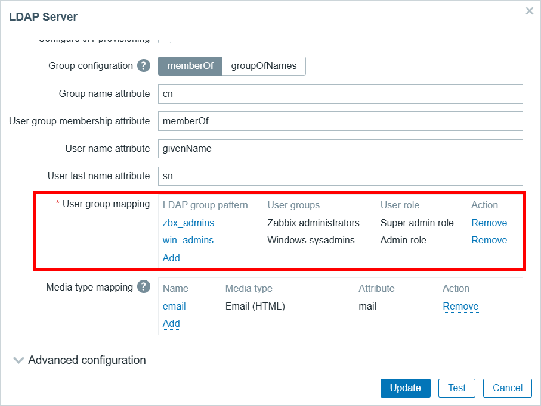

# LDAP mapping, user/host group mapping

Manage LDAP mapping, user/host group mapping for Zabbix 7.2

## Goal/functionality

* Manage permissions, group mapping completely outside Zabbix GUI
* Mostly user type "Zabbix Admin" will be used for user role. This allows flexibility for certain objects (hosts, templates) to be read only or write ready
* Script will create missing host groups automatically
* If template groups does not exist, then user group will not have access to templates.
* Allows to reconfigure LDAP mapping

## Tested and works with

* Python 3.10
* Zabbix 7.2.3
* Ubuntu 22.04

## Test frontend connection

On frontend server, test if frontend is reachable
```
curl -kL http://127.0.0.1 | grep Zabbix
```

## Download and install scripts

Install packages
```
sudo apt update
sudo apt-get -y install git python3-pip python3.10
```

Supply python dependencies
```
pip3.10 install jsonpath-ng urllib3
```


Download this project
```
cd && git clone https://github.com/aigarskadikis/zabbix-auth-roles-permissions.git && cd zabbix-auth-roles-permissions
```

Set python scripts executable:
```
chmod +x *.py
```


## Install API access characteristics

Create directory
```
mkdir -p /var/lib/zabbix
```

Configure frontend URL and API token 
```
echo "
api_jsonrpc = 'http://127.0.0.1/api_jsonrpc.php'
api_token = '814112f276f029a23e423e8f27ce4599d21934f11cc50de13553f3b1c3ff4e1c'
" | sudo tee /var/lib/zabbix/config.py
```

## List existing LDAP settings

list existing LDAP mapping
```
./listMappingLDAP.py
```

## create new LDAP mapping based on CSV

Create ldapmap.csv with contents:
```
LDAP group pattern,User groups,User role
zbx_admins,Zabbix administrators,Super admin role
lnx_admins,Linux sysadmins,Admin role
win_admins,Windows sysadmins,Admin role
ora_admins,Oracle administrators,Admin role
db_admins,DB administrators,Admin role
```

This will administer the position:



run:
```
./updateMappingLDAP.py
```


