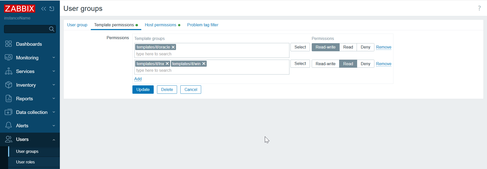

# LDAP mapping, user/host group mapping

* This is a solution for Zabbix where one company == one goal == one dream
* host group, template group, user group will use same prefix/pattern
* All teams will have read only access to other teams to view all events and graphs
* Each team itself will have writeable access to all host objects it belongs to their host, template group
* Write access will be to host/template group which belong to team
* LDAP mapping will be base on a custom pattern

## YAML example

```yaml
Linux-system-administrators:
  prefix: it/lnx
Windows-system-administrators:
  prefix: it/win
Oracle-DB-admins:
  prefix: it/oracle
```

## Outcome





## Tested and works with

* Python 3.10, 3.9
* Zabbix 7.2.3 (72.py), 7.0.9 (70.py)
* Ubuntu 22.04

## Test frontend connection

On frontend server, test if frontend is reachable
```
curl -kL http://127.0.0.1 | grep Zabbix
```

## Download and install scripts

Install packages
```
sudo apt update
sudo apt-get -y install git python3-pip python3.10
```

Supply python dependencies
```
pip3.10 install jsonpath-ng urllib3
```


Download this project
```
cd && git clone https://github.com/aigarskadikis/zabbix-auth-roles-permissions.git && cd zabbix-auth-roles-permissions
```

Set python scripts executable:
```
chmod +x *.py
```


## Recreate groups based on YAML

put location of "dc" in hosts file
```
grep dc /etc/hosts
```

test ldap connection:
```
ldapsearch -x \
-H ldap://dc:389 \
-D "CN=zbxldap,OU=Service users,DC=custom,DC=lan" \
-W \
-b "OU=Domain users,DC=custom,DC=lan" \
-s sub "(sAMAccountName=*)" dn
```

Create in 7.0:
```bash
python3.9 70.py \
--api_jsonrpc 'https://127.0.0.1:44370/api_jsonrpc.php' \
--token 'e4ca8af31d6c67e724bec411c23760d2867f96f327446d56ce9db2414c7871b1' \
--host 'dc' \
--port '389' \
--base_dn 'OU=Domain users,DC=custom,DC=lan' \
--bind_dn 'CN=zbxldap,OU=Service users,DC=custom,DC=lan' \
--bind_password 'Abc12345'
```

Create in 7.2:
```bash
python3.9 72.py \
--api_jsonrpc 'https://127.0.0.1:44372/api_jsonrpc.php' \
--token 'c40909c684312e2d8c2ca59811cc034e90ac31448a9e9ede8d70f3564aedcdf3' \
--host 'dc' \
--port '389' \
--base_dn 'OU=Domain users,DC=custom,DC=lan' \
--bind_dn 'CN=zbxldap,OU=Service users,DC=custom,DC=lan' \
--bind_password 'Abc12345'
```


