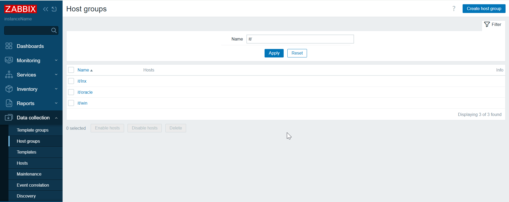
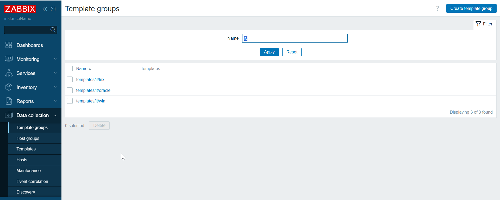
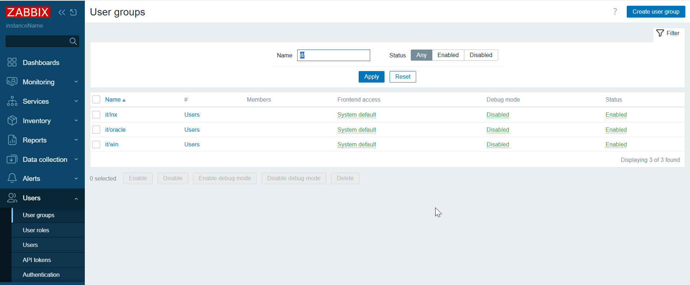
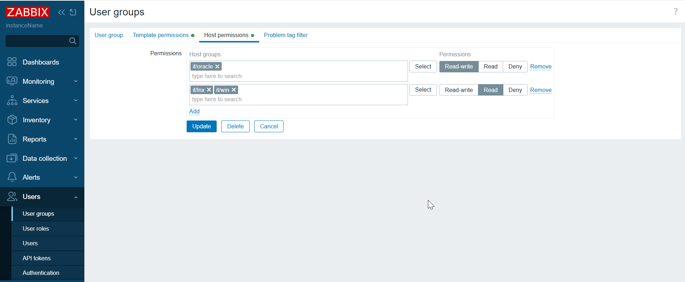
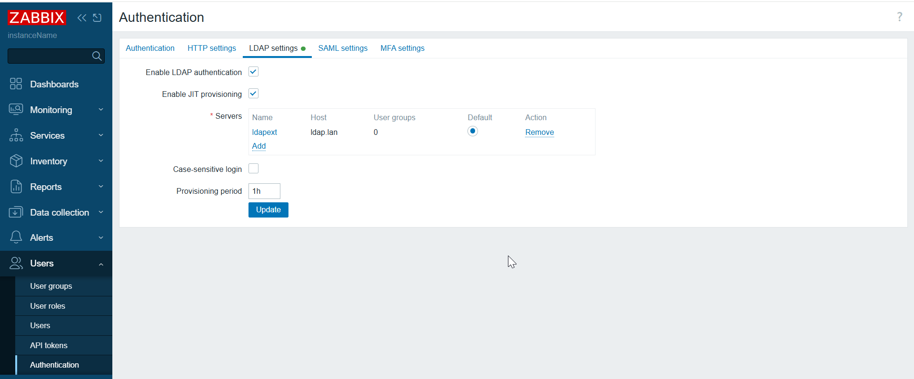
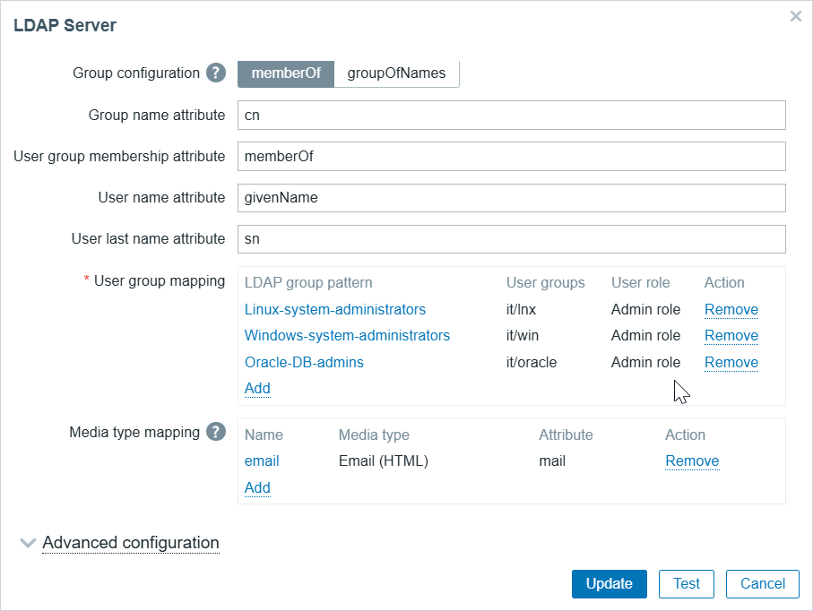

# LDAP mapping, user/host group mapping

* This is a solution for company where one goal == one dream
* host group, template group, user group will use same prefix/pattern
* All teams will have read only access to other teams to view all events and graphs
* Each team itself will have writeable access to all host objects it belongs to it (host, template) group
* Write access will be also to template group which belong to team
* LDAP mapping will be base on a custom pattern

## YAML example

```yaml
Linux-system-administrators:
  prefix: it/lnx
Windows-system-administrators:
  prefix: it/win
Oracle-DB-admins:
  prefix: it/oracle
```

## Outcome









## Tested and works with

* Python 3.10
* Zabbix 7.2.3
* Ubuntu 22.04

## Test frontend connection

On frontend server, test if frontend is reachable
```
curl -kL http://127.0.0.1 | grep Zabbix
```

## Download and install scripts

Install packages
```
sudo apt update
sudo apt-get -y install git python3-pip python3.10
```

Supply python dependencies
```
pip3.10 install jsonpath-ng urllib3
```


Download this project
```
cd && git clone https://github.com/aigarskadikis/zabbix-auth-roles-permissions.git && cd zabbix-auth-roles-permissions
```

Set python scripts executable:
```
chmod +x *.py
```


## List existing LDAP settings

Recreate groups based on YAML
```
./groups.py \
--api_jsonrpc http://127.0.0.1/api_jsonrpc.php \
--token 814112f276f029a23e423e8f27ce4599d21934f11cc50de13553f3b1c3ff4e1c \
--host 'ldap.lan' \
--port 389 \
--base_dn 'OU=Users,DC=ldap,DC=lan' \
--bind_dn 'CN=Service Accounts,DC=ldap,DC=lan' \
--bind_password 'BIND_PASSWORD'
```


